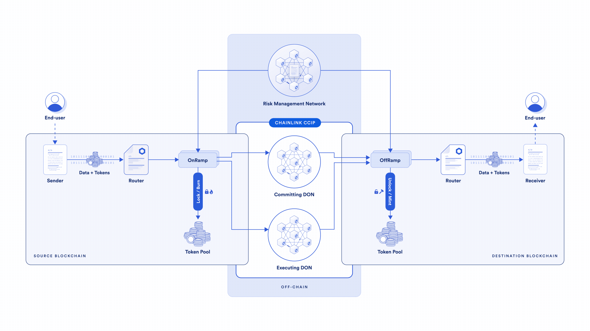

## About

## Study notes
Here i'm gonna put all my study notes, kinda of a summary of what i've learned about ccip based on 
- chainlink docs
- chainlink masterclass
- expert developer workshops 

### what's Chainlink CCIP
CCIP stands for `Chainlink Cross-Chain Interoperability Protocol (CCIP)``. It provides a single simple interface through which dApps and web3 entrepreneurs can securely meet all their cross-chain needs, including token transfers and arbitrary messaging.

### What's the problem?
- Blockchain by its nature is isolated, so it's hard to communicate with other blockchains or communicate natively with traditional systems to make external API calls ([Oracle problem](https://chain.link/education-hub/oracle-problem)).
- no standard way to communicate between blockchains
- the current solutions are not matured and inscure( given the huge amount of money lost in multi secuirity incidents)
- Without a blockchain interoperability protocol, Web2 systems and dApps would need to build separate in-house implementations for each cross-chain interaction that they want to use, which is a time-consuming, resource-intensive, and complex process.

## Why we need it?
Blockchain interoperability protocols provide the following capabilities:

- You can transfer assets and information across multiple blockchains.
- Application developers can leverage the strengths and benefits of different chains.
- Collaboration between developers from diverse blockchain ecosystems enables the building of cross-chain applications to serve more users and provide additional features or products for them.

## What's Chainlink CCIP can do?
Chainlink CCIP supports three main capabilities:

1. Arbitrary Messaging is the ability to send arbitrary data (encoded as bytes) to a receiving smart contract on a different blockchain. The developer is free to encode any data they wish to send.Note: This capability is specifically for smart contract receivers because EOAs on EVM blockchains cannot receive messages.
2. Token Transfer: You can transfer tokens to a smart contract or directly to an EOA on a different blockchain.
3. Programmable Token Transfer is the ability to simultaneously transfer tokens and arbitrary data (encoded as bytes) within a single transaction. This mechanism allows users to transfer tokens and send instructions on what to do with those tokens. For example, a user could transfer tokens to a lending protocol with instructions to leverage those tokens as collateral for a loan, borrowing another asset to be sent back to the user. Note: Use this capability only for smart contracts.  

## Architecture

### Terminology
- `Interoperability`: he ability to exchange information between different systems or networks, even if they are incompatible. Shared concepts on different networks ensure that each party understands and trusts the exchanged information. 
- `Finality`: The state of a transaction when it is no longer possible to revert it. Finality varies across different networks. Some networks offer instant finality and others require multiple confirmations. These time differences are set to ensure the security of CCIP and its users. Finality is crucial for token transfers because funds are locked and not reorganized once they are released onto the destination chain. In this scenario, finality ensures that funds on the destination chain are available only after they have been successfully committed on the source chain.
- `Lane`: A Chainlink CCIP lane is a distinct pathway between a source and a destination blockchain. Lanes are **unidirectional**. For instance, Ethereum Sepolia => Polygon Mumbai and Polygon Mumbai => Ethereum Sepolia are two different lanes.
- `DON`: Chainlink Decentralized Oracle Networks, or DONs, run Chainlink OCR2. The protocol runs in **rounds** during which an **observed data value might be agreed upon**. The output of this process results in a report which is attested to by a quorum of participants. The report is then transmitted on-chain by one of the participants. No single participant is responsible for transmitting on every round, and all of them will attempt to do so in a round-robin fashion until a transmission has taken place. In the context of CCIP, **a lane contains two OCR DON committees** that monitor transactions between a source and destination blockchain: the **Committing DON** and **Executing DON**. 
- `ARM`: The Active Risk Management (ARM) network is built using off-chain and on-chain components:

   - Off-chain: Several ARM nodes continually monitor all supported chains against abnormal activities
   - On-chain: One ARM contract per supported CCIP chain

- 
### Components
1. On chain (smart contract):
   - `Router contract`: 
     - The Router is the primary contract CCIP users interface with. 
     - This contract is responsible for initiating cross-chain interactions. 
     - **One router** contract exists **per chain**. 
     - When transferring tokens, **callers have to approve tokens for the router contract**. 
     - The router contract **routes** the instruction to the destination-specific **OnRamp**. 
     - When a message is received on the destination chain, the router is the contract that “delivers” tokens to the user's account or the message to the receiver's smart contract.
   - `CommitStore contract`:
     - The **Committing DON interacts with the CommitStore contract on the destination blockchain** to store the Merkle root of the finalized messages on the source blockchain. This Merkle root must be blessed by the Active Risk Management before Executing DON can execute them on the destination blockchain.
     - The CommitStore ensures the message is blessed by the Active Risk Management Network and only one CommitStore exists per lane.
   - `OnRamp contract`: **One OnRamp contract per lane exists**. This contract performs the following tasks:
        1. Checks destination-blockchain-specific validity such as validating account address syntax
        2. Verifies the message size limit and gas limits
        3. Keeps track of sequence numbers to preserve the sequence of messages for the receiver
        4. Manages billing
        5. Interacts with the TokenPool if the message includes a token transfer.
        6. Emits an event monitored by the committing DON
   - `OffRamp contract`: **One OffRamp contract per lane exists.** This contract performs the following tasks:
        1. Ensures the message is authentic by verifying the proof provided by the Executing DON against a committed and blessed Merkle root
        2. Makes sure transactions are executed only once
        3. After validation, the OffRamp contract transmits any received message to the Router contract. If the CCIP transaction includes token transfers, the OffRamp contract calls the TokenPool to transfer the correct assets to the receiver.

   - `Token Pool contract`: Each token has its own token pool, an abstraction layer over ERC-20 tokens that facilitates OnRamp and OffRamp token-related operations. Token pools are configurable to lock or burn at the source blockchain and unlock or mint at the destination blockchain based on the token characteristics e.g :
     - `Blockchain-native gas tokens` [**"Lock and Mint"**] 
       - Why? 
         - tokens such as ETH, MATIC, and AVAX, can only be minted on their native chains. **These tokens cannot be burned on the source and minted at the destination to transfer these tokens between chains.** Instead, the linked token pool uses a "Lock and Mint" approach that locks the token at its source and then mints a wrapped or synthetic asset on the destination blockchain. 
       - `LINK token` [**"Lock and Mint"**] 
         - Why ? 
           - A token like LINK is minted on a single chain (Ethereum mainnet) with a fixed total supply. **CCIP cannot natively mint it on another chain**. In this case, the "Lock and Mint" approach is required.
       - `tokens that could be minted on multiple chains` [**"Burn and Mint"**] 
         - Why? 
           - Some tokens can be minted on multiple chains. Examples of such tokens include stablecoins like USDC, TUSD, USDT, and FRAX. The linked token pools use a "Burn and Mint" method to burn the token at its source and then mint it natively on the destination blockchain. Wrapped assets such as WBTC or WETH are other examples that use the "Burn and Mint" approach.
       - `token with a Proof Of Reserve (PoR) ` [**"Lock and Mint"**] 
         - Why? 
           - A token with a Proof Of Reserve (PoR) feed on a specific chain poses a challenge for the "Burn and Mint" method when applied to other chains because **it conflicts with the PoR feed**. For these tokens, "Lock and Mint" is the preferred approach.
   - `ARM contract`: The ARM contract maintains the list of ARM nodes' addresses allowed to bless/curse and holds the quorum logic for blessing a committed Merkle Root and cursing CCIP on a destination blockchain.
     - There is one ARM contract for each supported destination chain. T
     - he ARM contract maintains a group of nodes authorized to participate in the ARM blessing/cursing. 
     - Each ARM node has five components: 
       1. an address for voting to curse, 
       2. an address for voting to bless, 
       3. an address for withdrawing a vote to curse, 
       4. a curse weight, and
       5.  a blessing weight.
       -  The contract also maintains two thresholds to determine the quorum for blessing and cursing.
    -   There are two different voting logics depending on the mode:
        -   **Blessing voting procedure**: every time an ARM node blesses a Merkle root, the ARM contract adds the blessing weight for that node. If the sum exceeds the blessing threshold, the ARM contract considers the contract blessed.
        -   **Cursing voting procedure**: an ARM node that sends a vote to curse assigns the vote a random 32-byte ID. 
            -   **(This part still not clear and I need to ask and research)** `The node may have multiple active votes to curse at any time. However, if there is at least one active cursing vote, the ARM contract considers the node to have voted to curse. The ARM contract adds the cursing weight for that node. If the sum of the weights of votes to curse exceeds the curse threshold, the ARM contract considers the contract cursed.If the ARM contract is cursed, then the owner of the original contract must resolve any underlying issues the original contract might have. If the owner is satisfied that these issues have been resolved, they can revoke the cursing on behalf of ARM nodes.`

1. Off chain:
    - `Committing DON`:as several jobs where each job **monitors cross-chain** transactions between a given source blockchain and destination blockchain:
       1. Each job monitors events from a given OnRamp contract on the source blockchain.
       2. The job waits for finality, which depends one the source blockchain.
       3. The job bundles transactions and creates a Merkle root. This Merkle root is signed by a quorum of oracles nodes part of the Committing DON.
       4. Finally, the job writes the Merkle root to the CommitStore contract on the given destination blockchain.
    - `Executing DON`: has several jobs where each **executes cross-chain transactions** between a source blockchain and a destination blockchain
      1. Each job monitors events from a given OnRamp contract on the source blockchain.
      2. The job checks whether the transaction is part of the relayed Merkle root in the CommitStore contract.
      3. The job waits for the Active Risk Management network to bless the message.
      4. Finally, the job creates a valid Merkle proof, which is verified by the OffRamp contract against the Merkle root in the CommitStore contract. 
      5. After these check pass, the job calls the OffRamp contract to complete the CCIP transactions on the destination blockchain.
   - `ARM network`: a set of independent nodes that monitor the Merkle roots committed by the **Committing DON** into the Commit Store.
     - Each node compares the committed Merkle roots with the transactions received by the OnRamp contract. After the verification succeeds, it calls the ARM contract to "bless"  the committed Merkle root. 
     - When there are enough blessing votes, the root becomes available for execution. 
     - In case of anomalies, each ARM node calls the ARM contract to "curse"  the system. If the cursed quorum is reached, the ARM contract is paused to prevent any CCIP transaction from being executed.
  
  **Note** : You might wonder why we have 2 DONs? 
  - Separating commitment and execution permits the Active Risk Management network **to have enough time to check the commitment of messages before executing them**. 
  - The delay between commitment and execution also permits **additional checks** such as abnormal reorg depth, potential simulation, and slashing.

 ## CCIP Billing 
 -  CCIP uses a gas-locked fee payment mechanism  in the **source chain**  through `feeToken`. this means you can simply pay on the source chain and CCIP will take care of execution on the destination chain 
 - CCIP supports fee payments in LINK and in alternative assets, which currently includes blockchain-native gas tokens and their ERC20 wrapped versions
 - On each source chain, CCIP maintains a cache of destination gas prices, denominated in each feeToken. To prevent staleness, these prices are routinely updated by either piggybacking user messages or timeouts.  
 - fees include both gas cost overhead and a flat/basis points premium as follows:
   - **Destination gas overhead**: This is the average overhead incurred on the destination chain by CCIP to process the message and/or token transfer.
   - **Flat network premium for messages**: this fee is a static amount that users pay when sending cross-chain messages.
   - **Basis point based premium for tokens**: This is a percentage-based fee that users pay for cross-chain token transfers. It is calculated using the following expression: `tokenAmount x price x bps ratio`. 
     - price is initially denominated in **USD** and translated into the feeToken.
   - If the user pays in alternative assets rather than LINK, **a 10% surcharge **is applied to the premium portion of the fee.
## Execution latency ( excess of one hour should be rare)
- Normally any fee-paid transaction (within an acceptable range of the execution cost)is transmitted as soon as possible after it is blessed by the ARM Network. If the cost of execution increases between request and execution time, CCIP will incrementally increase the gas price to attempt to reach eventual execution, but this might introduce additional latency.
- If the DON fails to execute within the duration of, user can manually execute the transaction through the CCIP explorer.( manual execution is enabled if time exceeds `permissionlessExecutionThresholdSeconds` parameter)
## CCIP Supported Networks
 - Ethereum 
   - Ethereum Mainnet
     - Ethereum Mainnet → Polygon Mainnet Lane (Token transfers are not supported on this lane.)
   - Ethereum Sepolia
     - Ethereum Sepolia → Optimism Goerli Lane
     - Ethereum Sepolia → Arbitrum Goerli Lane
     - Ethereum Sepolia → Avalanche Fuji Lane
     - Ethereum Sepolia → Polygon Mumbai Lane
 - Optimism
   - Optimism Mainnet
     - Optimism Mainnet → Ethereum Mainnet Lane
   - Optimism Goerli
     - Optimism Goerli → Ethereum Sepolia Lane
     - Optimism Goerli → Arbitrum Goerli Lane
     - Optimism Goerli → Avalanche Fuji Lane
 - Avalanche
   - Avalanche Mainnet
     - Avalanche Mainnet → Ethereum Mainnet Lane (Token transfers are not supported on this lane.)
   - Avalanche Fuji
     - Avalanche Fuji → Ethereum Sepolia Lane
     - Avalanche Fuji → Optimism Goerli Lane
     - Avalanche Fuji → Polygon Mumbai Lane
 - Polygon
   - Polygon Mainnet
     - Polygon Mainnet → Ethereum Mainnet Lane (Token transfers are not supported on this lane.)
   - Polygon Mumbai
     - Polygon Mumbai → Ethereum Sepolia Lane
     - Polygon Mumbai → Avalanche Fuji Lane
 - Arbitrum
    - Arbitrum Goerli
     - Arbitrum Goerli → Ethereum Sepolia Lane
     - Arbitrum Goerli → Optimism Goerli Lane

For further details about CCIP supported networks and tokens, please refer to the [Chainlink documentation](https://docs.chain.link/ccip/supported-networks).
## How it works? a scenario from A to Z to better understand the flow

## CCIP Best Practices

https://docs.chain.link/ccip/best-practices 

## coding time :~)

